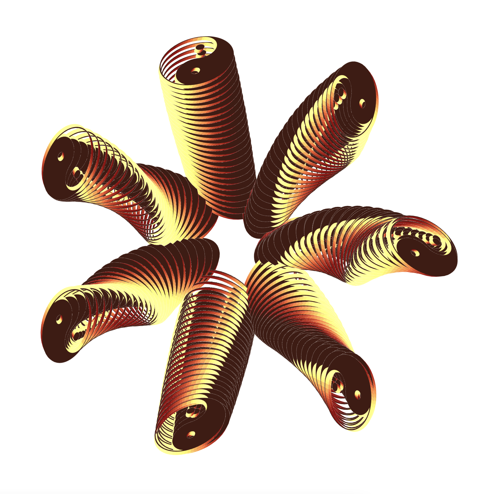

# rothpage

An algorithmic GIF composition made for the Professional Practice Artware class taught by Nick Briz at SAIC. The piece is an homage to Evan Roth's [A Tribute To Heather](http://www.evan-roth.com/work/tribute-to-heather/).

◕ ◞ ◕ This project was made using https://netnet.studio
